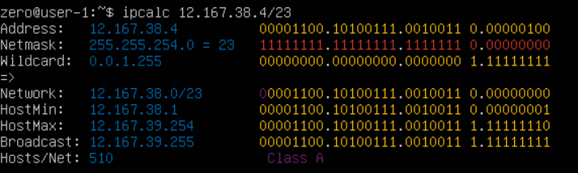
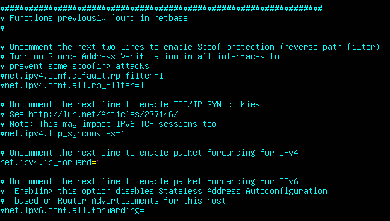
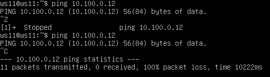
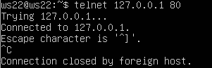
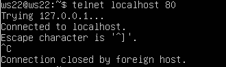

## Task 1

1.1.

1) адрес сети 192.167.38.54/13 - 192.160.0.0/13

2) перевод маски 255.255.255.0 в префиксную запись = /24 
\
перевод маски 255.255.255.0 в двоичную запись = 11111111.11111111.11111111.00000000

\
перевод /15 в обычную запись = 255.254.0.0 
\
перевод /15 в двоичную запись = 11111111.11111110.00000000.00000000

\
перевод 11111111.11111111.11111111.11110000 в обычную запись = 255.255.255.240
\
перевод 11111111.11111111.11111111.11110000 в префиксную запись = /28

3)  в сети 12.167.38.4/8 минимальный хост = 12.0.0.1 и максимальный хост = 12.255.255.254

в сети 12.167.38.4/16 минимальный хост = 12.167.0.1 и максимальный хост = 12.167.255.254

в сети 12.167.38.4/23 минимальный хост = 12.167.38.1 и максимальный хост = 12.167.39.254

в сети 12.167.38.4/4 минимальный хост = 0.0.0.1 и максимальный хост = 15.255.255.254

1.2. 
Диапазон localhost: 127.0.0.1 - 127.255.255.254
\
По адресам 127.0.0.2, 127.1.0.1 -  можно обратиться

1.3. Диапазоны и сегменты сетей

1) Частные: 10.0.0.45, 192.168.4.2, 10.10.10.10, 172.20.250.4, 172.16.255.255
\
Публичные: 134.43.0.2, 172.0.2.1, 192.172.0.1, 172.68.0.2, 192.169.168.1

2)  IP адреса шлюза возможные у сети 10.10.0.0/18 - 10.10.0.2, 10.10.10.10, 10.10.1.255

## Task 2

2.0.

Изменение etc/netplan/00-installer-config.yaml для ws1

Изменение etc/netplan/00-installer-config.yaml для ws2

2.1.

Добавление статического маршрута для ws1

Добавление статического маршрута для ws2

ping с машины ws1 на ws2

ping с машины ws2 на ws1

2.2.

Добавлен статический маршрут с ws1 на ws2

Добавлен статический маршрут с ws2 на ws1

ping с машины ws1 на ws2

ping с машины ws2 на ws1

## Task 3

3.1.

Перевод записи: \
8 Mbps = 1 MB/s \
100 MB/s = 819200 Kbps \
1 Gbps = 1024 Mbps

3.2.

Измерение скорости соединения ws1 с ws2 при помощи утилиты iperf3

Для этого сделаем ws1 сервером (порт оставим стандартный 5201, а также укажем формат вывода для скорости соединения). Делается следующей командой на машине ws1: iperf -s -f K

На ws2 необходимо ввести команду iperf3 -c 192.168.100.10 -f K

## Task 4

4.1. 

Настройка firewall.sh на магине ws1 

Настройка firewall.sh на магине ws2

Запуск скриптов 

ws1:

ws2:

Разница в последовательности. Правила,находящиеся выше по цепочке более приоритетны и исполняются в первую очередь

4.2.

ping на ws1

ping на ws2

nmap на ws1

## Task 5

5.1.

Настройка адресов машин: 

ws11

ws21

ws22

r1

r2

ping ws22 на ws21

ping r1 на ws11

5.2.

использование sysctl -w net.ipv4.ip_forward=1 на r1 и r2

r1

r2

изменение /etc/sysctl.conf

r1

r2

5.3.

Вывод .ymal файла с настроенными маршрутами по умолчанию

ws11

ws21 \

ws22

Вывод ip r

ws11

ws21

ws22

пиг r2 с ws11 

ws11

r2

5.4.

добалвены в r1 и r2 стат маршруты в фале конфигурации

r1

r2

вызов ip r для r1 и r2

r1

r2

команда ip r list 10.10.0.0/18 и ip r list 0.0.0.0/0

Для адреса 10.10.0.0/18 был выбран маршрут, отличный от 0.0.0.0/0, так как маршрут по умолчанию имеет меньшую приоритетность.

5.5.

При помощи утилиты traceroute построить список маршрутизаторов на пути от ws11 до ws21

Для определения промежуточных маршрутизаторов traceroute отправляет серию пакетов данных целевому узлу, при этом каждый раз увеличивая на 1 значение поля TTL («время жизни»). Это поле обычно указывает максимальное количество маршрутизаторов, которое может быть пройдено пакетом. Первый пакет отправляется с TTL, равным 1, и поэтому первый же маршрутизатор возвращает обратно сообщение ICMP, указывающее на невозможность доставки данных. Traceroute фиксирует адрес маршрутизатора, а также время между отправкой пакета и получением ответа (эти сведения выводятся на монитор компьютера). Затем traceroute повторяет отправку пакета, но уже с TTL, равным 2, что позволяет первому маршрутизатору пропустить пакет дальше.

Процесс повторяется до тех пор, пока при определённом значении TTL пакет не достигнет целевого узла. При получении ответа от этого узла процесс трассировки считается завершённым.

5.6.

Запустить на r1 перехват сетевого трафика, проходящего через eth0 с помощью команды:
tcpdump -n -i eth0 icm. 
Пропинговать с ws11 несуществующий IP (например, 10.30.0.111) с помощью команды:
ping -c 1 10.30.0.111

## Task 6

Предже чем настраивать DHCP сервер необходимо его установить на r2 командой sudo apt install isc-dhcp-server. После необходимо его включить, указав сетевой интерфейс для работы. Для этого нужно изменить файл /etc/default/isc-dhcp-server

настройка DHCP сервера на r2 в файле /etc/dhcp/dhcpd.conf

Изменение файла /etc/resolv.conf

Чтобы DHCP сервер выдал IP адрес ws21, необходимо изменить .ymal файл и установить автаматическое присвоение ipv4 адреса 

Теперь мы видим, что наш настроеный DHCP сервер на r2 присвоил IP адрес ws21 из выделенного диапазона. И мы можем пропинговать машину ws22

Теперь необходимо сделать это такую же настройку для r1 и ws11 за исключением того, что IP адрес будет присваиваться исходя из mac адреса устройства. Для этого меняем ymal файл на ws11. (чтобы все работало пришлось также выставить в VB нужный мак адрес)

Снова меняем файл /etc/default/isc-dhcp-server , но на r1

Настройка DHCP сервера на r1 в файле /etc/dhcp/dhcpd.conf

Изменение файла /etc/resolv.conf

Проверяем, что IP выданый DHCP для ws11 совпадает с определенным нами списком выделенных адресов

## Task 7

В файле /etc/apache2/ports.conf на ws22 и r1 изменить строку Listen 80 на Listen 0.0.0.0:80, то есть сделать сервер Apache2 общедоступным

Запустить веб-сервер Apache командой service apache2 start на ws22 и r1

r1

 

ws22

 

Добавить в фаервол, созданный по аналогии с фаерволом из Части 4, на r2 следующие правила:

1) удаление правил в таблице filter - iptables -F

2) удаление правил в таблице "NAT" - iptables -F -t nat

3) отбрасывать все маршрутизируемые пакеты - iptables --policy FORWARD DROP

Проверить соединение между ws22 и r1 командой ping

Добавить в файл ещё одно правило:

4) разрешить маршрутизацию всех пакетов протокола ICMP

Проверить соединение между ws22 и r1 командой ping

При запуске файла с этими правилами, ws22 должна "пинговаться" с r1

Добавить в файл ещё два правила:

5) включить SNAT, а именно маскирование всех локальных ip из локальной сети, находящейся за r2 (по обозначениям из Части 5 - сеть 10.20.0.0)
Совет: стоит подумать о маршрутизации внутренних пакетов, а также внешних пакетов с установленным соединением

6) включить DNAT на 8080 порт машины r2 и добавить к веб-серверу Apache, запущенному на ws22, доступ извне сети
Совет: стоит учесть, что при попытке подключения возникнет новое tcp-соединение, предназначенное ws22 и 80 порту

роверить соединение по TCP для SNAT, для этого с ws22 подключиться к серверу Apache на r1 командой:
telnet [адрес] [порт]

Проверить соединение по TCP для DNAT, для этого с r1 подключиться к серверу Apache на ws22 командой telnet (обращаться по адресу r2 и порту 8080)

## Task 8 

Запустить веб-сервер Apache на ws22 только на localhost (то есть в файле /etc/apache2/ports.conf изменить строку Listen 80 на Listen localhost:80)

Воспользоваться Local TCP forwarding с ws21 до ws22, чтобы получить доступ к веб-серверу на ws22 с ws21

Воспользоваться Remote TCP forwarding c ws11 до ws22, чтобы получить доступ к веб-серверу на ws22 с ws11

Для проверки, сработало ли подключение в обоих предыдущих пунктах, перейдите во второй терминал (например, клавишами Alt + F2) и выполните команду:
telnet 127.0.0.1 [локальный порт]

